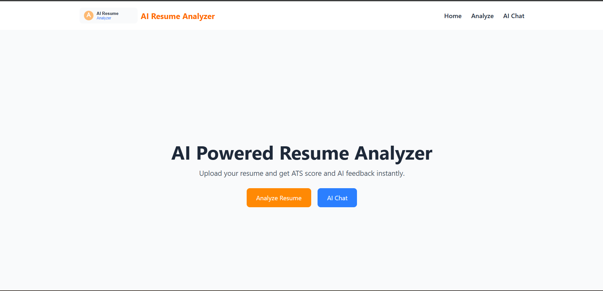
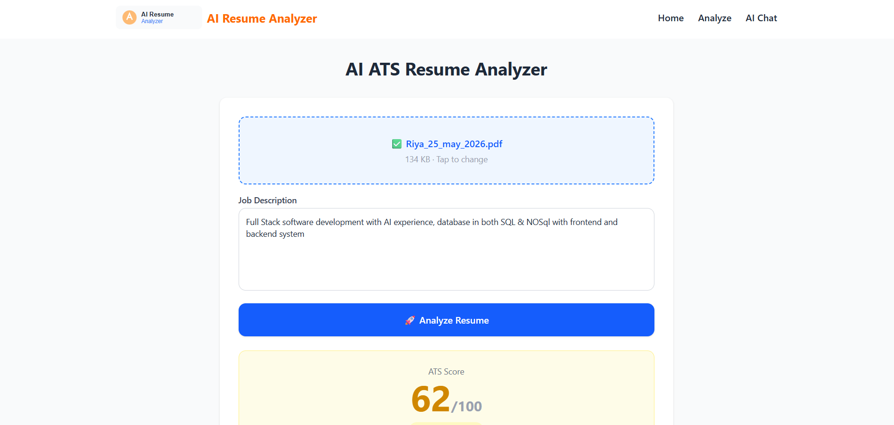
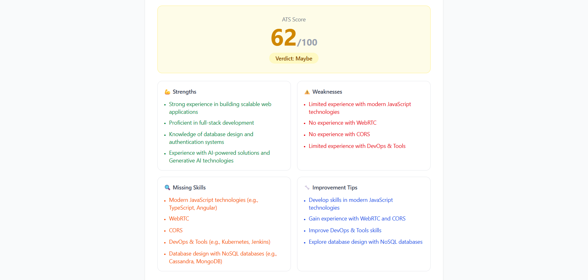
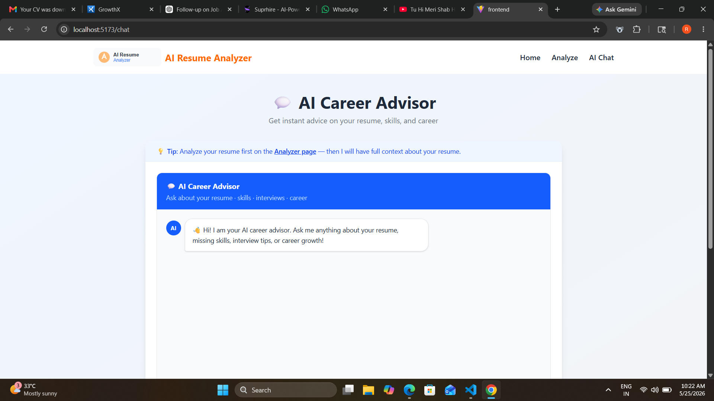
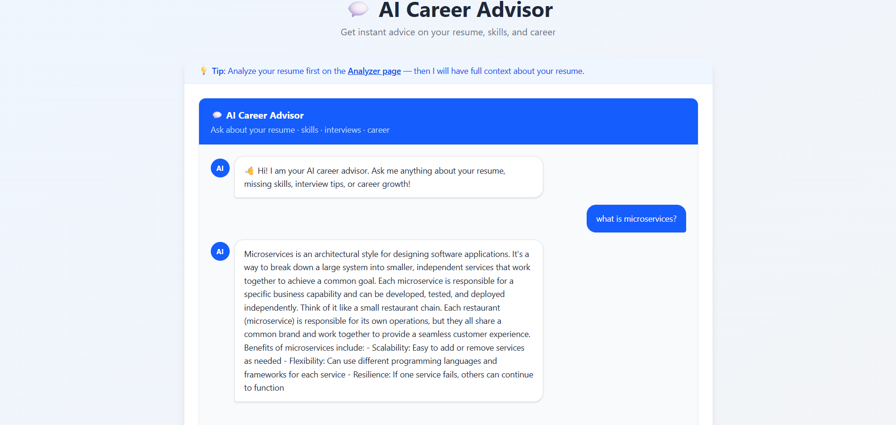

# 🤖 AI Resume Analyzer with AI Chatbot Memory


An intelligent full-stack web application that analyzes resumes using AI and provides personalized career guidance through a chatbot with memory.

Built using FastAPI, React, MongoDB, and Groq AI.

--- 
# 🌟 Why This Project?

Many candidates get rejected by Applicant Tracking Systems (ATS) before recruiters even review their resumes.

This AI-powered platform helps users:   

- Improve ATS scores
- Optimize resumes
- Receive AI-generated feedback
- Get personalized career guidance
- Understand skill gaps for job roles

The chatbot uses stored resume context and memory to provide personalized responses and career suggestions.

---

# 🚀 Features

✅ AI-powered ATS Resume Analysis  
✅ AI Chatbot with Memory (MongoDB)  
✅ Resume-based Career Guidance  
✅ FastAPI REST Backend  
✅ Modern React + Tailwind Frontend  
✅ MongoDB Database Integration  
✅ Real-world Production-level Architecture  
✅ Resume Context-aware Chatbot  
✅ Job Description Matching  
✅ AI-generated Resume Suggestions  

---

# 📸 Project Screenshots

## 🏠 Home Page



---  

## 📄 Resume Analyzer Page



---

## 📊 ATS Analysis Result



---

## 🤖 AI Chatbot Interface



---

## 💬 AI Chatbot Conversation



---

# 🧠 How it Works

1. User uploads resume and job description  
2. PDF resume text gets extracted  
3. AI analyzes resume content  
4. ATS score is generated  
5. Resume data is stored in MongoDB  
6. Chatbot uses stored resume memory  
7. AI provides personalized career guidance  

---

# 🛠 Tech Stack

## Frontend

- React.js
- Tailwind CSS
- Axios

## Backend

- FastAPI
- Python
- REST API

## Database

- MongoDB

## AI

- Groq API (LLM)

---

# 📂 Project Structure

```bash
ai-ats-resume-analyzer/
│
├── backend/
│   ├── cache.py
│   ├── chatbot.py
│   ├── config.py
│   ├── database.py
│   ├── main.py
│   ├── resume_ai.py
│   ├── utils.py
│   └── .env
│
├── frontend/
│   ├── src/
│   │   ├── pages/
│   │   ├── components/
│   │   └── App.jsx
│   │
│   └── package.json
│
├── images/
│   ├── home.png
│   ├── analyzer.png
│   ├── Result.png
│   ├── Chatbot.png
│   └── Chatbot2.png
│
├── requirements.txt
├── runtime.txt
├── .gitignore
└── README.md
```

---

# ⚙️ Installation

## 1️⃣ Clone Repository

```bash
git clone https://github.com/Riya-sahu29/ai-ats-resume-analyzer.git

cd ai-ats-resume-analyzer
```

---

# 🔧 Backend Setup

```bash
cd backend

python -m venv .venv

.venv\Scripts\activate

pip install -r requirements.txt
```

## Create `.env`

```env
GROQ_API_KEY=your_api_key
```

## Run Backend

```bash
uvicorn main:app --reload
```

Backend runs on:

```bash
http://127.0.0.1:8000
```

---

# 💻 Frontend Setup

```bash
cd frontend

npm install

npm run dev
```

Frontend runs on:

```bash
http://localhost:5173
```

---

# 📡 API Endpoints

## Analyze Resume

```http
POST /analyze-resume
```

## Chatbot

```http
POST /chat
```

---

# 🧠 Database Collections

MongoDB automatically creates:

- `chat_history`
- `resume_data`

---

# 💬 Example Chat

### User

```bash
Suggest backend skills based on my resume
```

### AI

```bash
You should focus on FastAPI, MongoDB, REST API, Docker, and cloud deployment.
```

---

# 🎯 Use Cases

- Students preparing for placements
- Resume optimization
- Career guidance
- Interview preparation
- ATS score improvement
- Skill gap analysis

---

# 🔮 Future Improvements

- User Authentication
- Resume History Dashboard
- Cloud Deployment (AWS)
- Docker Support
- Vector Database Memory
- Multi-resume Support
- AI Interview Preparation
- Resume Rewriting Suggestions

---

# 🎥 Demo Video

[Watch Demo Video](ADD_YOUR_VIDEO_LINK_HERE)

---

# 👩‍💻 Author

## Riya Priyadarsani Sahu

GitHub:  
https://github.com/Riya-sahu29

---

# ⭐ Resume-Level Project Highlights

✔ Full-Stack Application  
✔ AI Integration  
✔ Database Memory  
✔ REST API Development  
✔ Production Architecture  
✔ AI Chatbot Context Memory  
✔ Modern Frontend + Backend Integration  

---

# 📜 License

This project is for educational and portfolio purposes.
